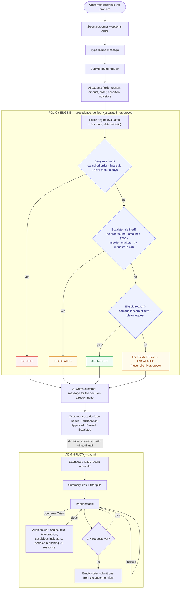

# User Journey

Core flow from refund request to decision, plus the admin review flow.

```mermaid
flowchart TD
    Start(["Customer describes the problem"]) --> Select["Select customer + optional order"]
    Select --> Text["Type refund message"]
    Text --> Submit["Submit refund request"]
    Submit --> Extract["AI extracts fields: reason, amount, order, condition, indicators"]
    Extract --> Engine["Policy engine evaluates rules (pure, deterministic)"]

    subgraph POLICY["POLICY ENGINE — precedence: denied > escalated > approved"]
        direction TB
        Engine --> P1{"Deny rule fired?<br/>cancelled order · final sale · older than 30 days"}
        P1 -->|"yes"| PDeny["DENIED"]
        P1 -->|"no"| P2{"Escalate rule fired?<br/>no order found · amount > $500 ·<br/>injection markers · 3+ requests in 24h"}
        P2 -->|"yes"| PEsc["ESCALATED"]
        P2 -->|"no"| P3{"Eligible reason?<br/>damaged/incorrect item · clean request"}
        P3 -->|"yes"| PApp["APPROVED"]
        P3 -->|"no"| PNone["NO RULE FIRED → ESCALATED<br/>(never silently approve)"]
    end

    PDeny --> Msg["AI writes customer message for the decision already made"]
    PEsc --> Msg
    PApp --> Msg
    PNone --> Msg
    Msg --> Result["Customer sees decision badge + explanation:<br/>Approved · Denied · Escalated"]

    Result -.->|"decision is persisted with full audit trail"| Admin

    subgraph ADMIN["ADMIN FLOW — /admin"]
        direction TB
        Admin["Dashboard loads recent requests"] --> Tiles["Summary tiles + filter pills"]
        Tiles --> Table["Request table"]
        Table -->|"filter: All / Approved / Denied / Escalated"| Table
        Table -->|"Refresh"| Table
        Table -->|"open row / View"| Drawer["Audit drawer: original text, AI extraction,<br/>suspicious indicators, decision reasoning, AI response"]
        Drawer -->|"close"| Table
        Table --> Empty{"any requests yet?"}
        Empty -->|"no"| EmptyState["Empty state: submit one from the customer view"]
        Empty -->|"yes"| Table
    end

    classDef denied fill:#fef2f2,stroke:#dc2626,color:#991b1b;
    classDef escalated fill:#fffbeb,stroke:#d97706,color:#92400e;
    classDef approved fill:#f0fdf4,stroke:#16a34a,color:#14532d;
    classDef dec fill:#eef2ff,stroke:#6366f1,color:#312e81;

    class PDeny denied;
    class PEsc,PNone escalated;
    class PApp approved;
    class P1,P2,P3 dec;
```
